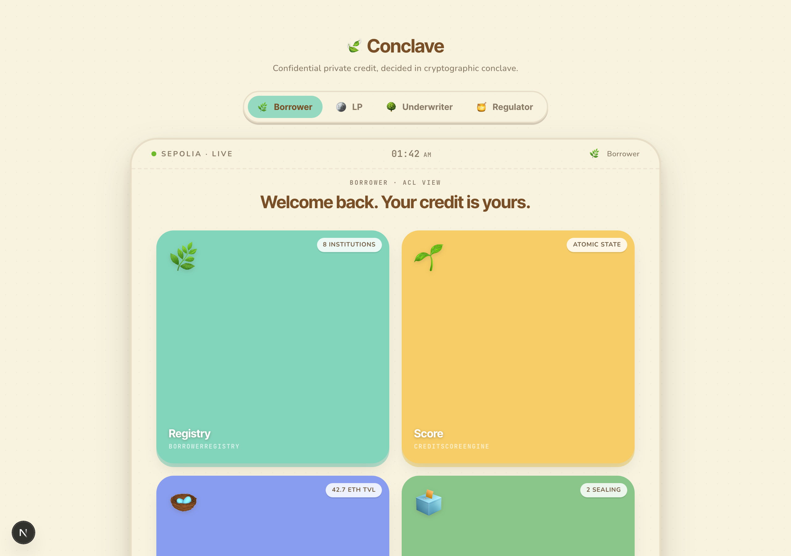
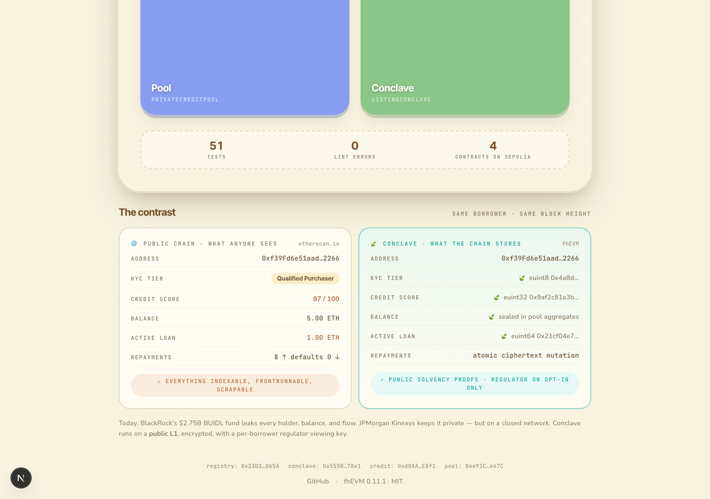
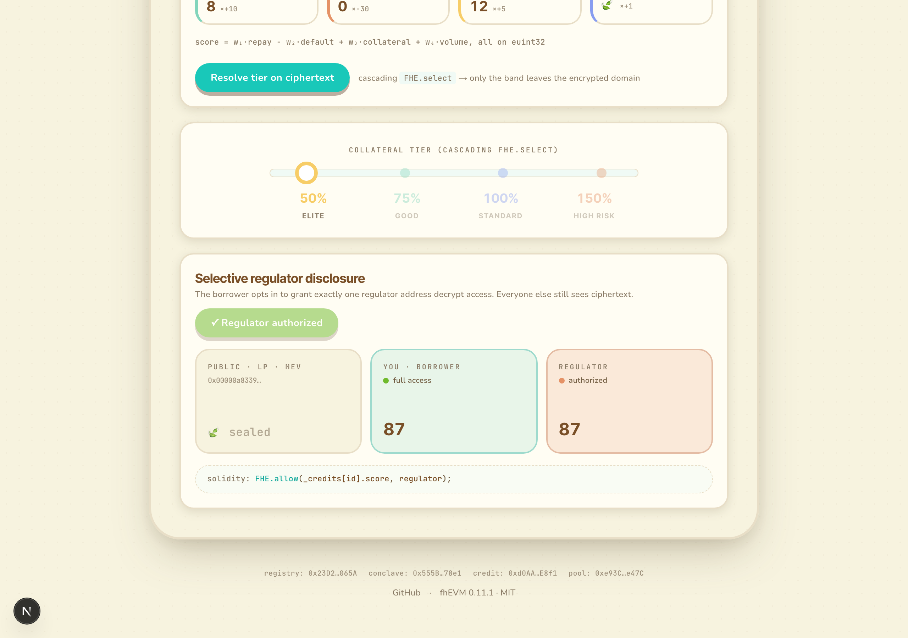
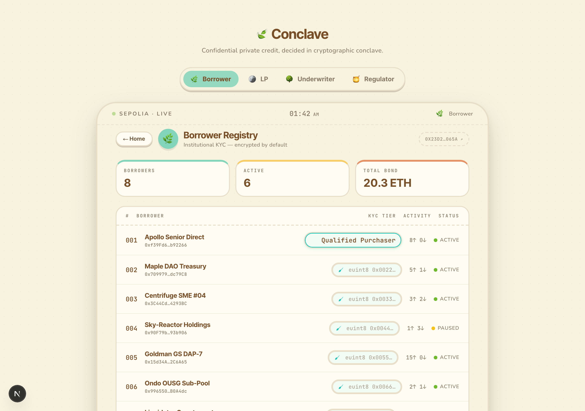
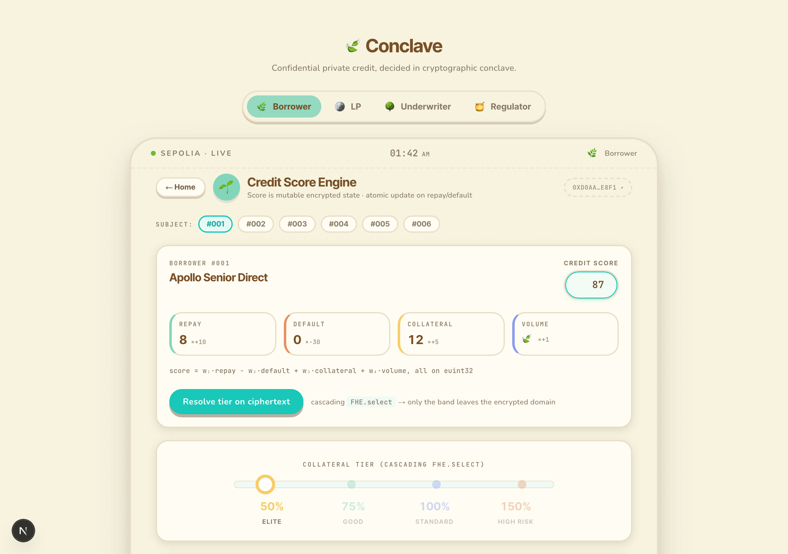
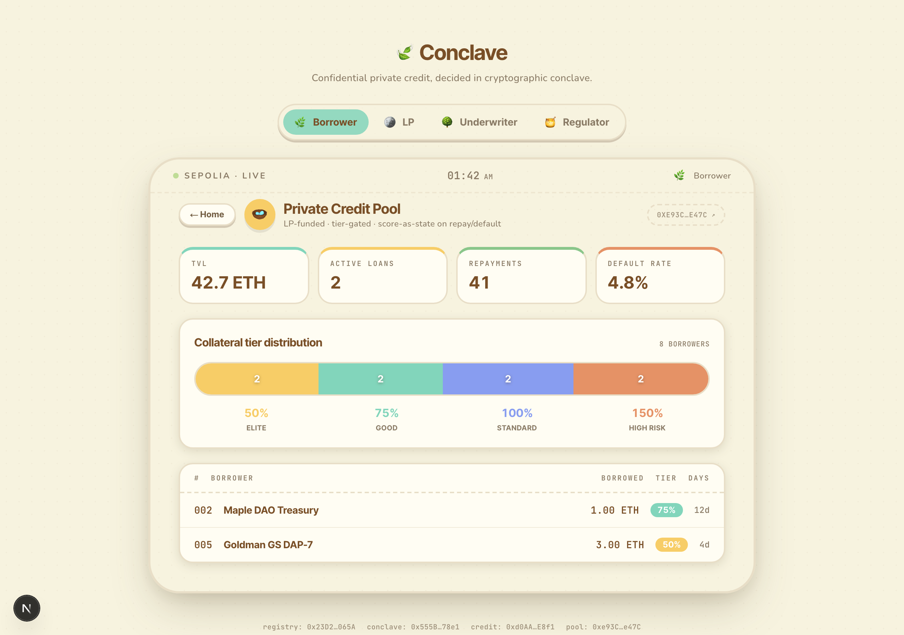
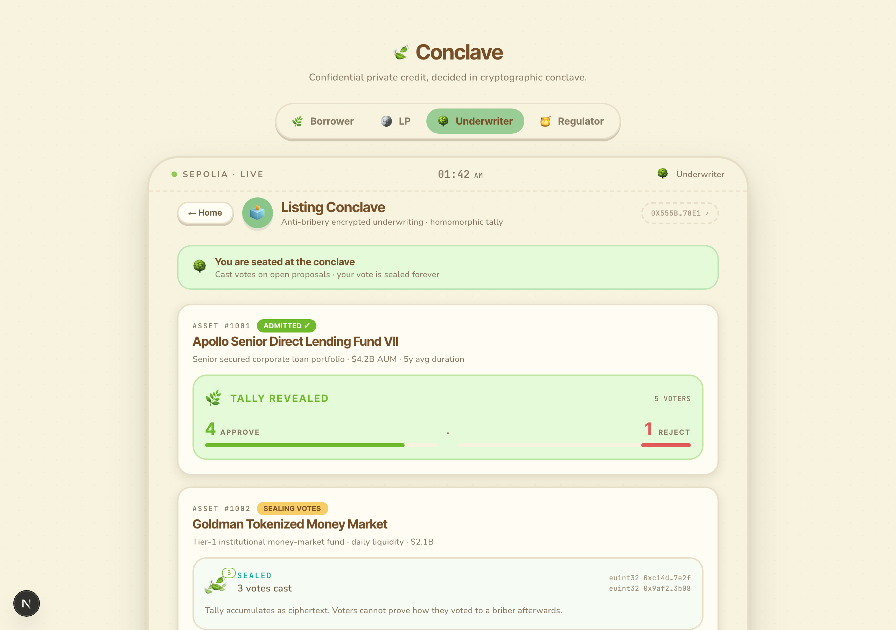

# Conclave

A confidential private-credit pool for tokenized RWA, built on [Zama fhEVM](https://docs.zama.ai/protocol). Borrower KYC tier, credit score, and pool position stay encrypted on a public L1; tier-based collateral resolution runs entirely on ciphertext; underwriting decisions are sealed in homomorphic conclave.

[](https://conclave-rho.vercel.app)
[](#deployments)
[](#tests)
[](#anti-pattern-audit)
[](LICENSE)

<p align="center">
  
</p>

<p align="center">
  <em>Four contracts surface as four apps; the persona switcher mirrors fhEVM's <code>FHE.allow</code> ACL — the same encrypted state, viewed through different keys.</em>
</p>

## The contrast

<p align="center">
  
</p>

<p align="center">
  <em>The same borrower at the same block height. Today, BlackRock's $2.75B BUIDL fund leaks every holder, balance, and flow. JPMorgan Kinexys keeps it private — but on a closed network. Conclave runs on a <strong>public L1</strong>, encrypted, with a per-borrower regulator viewing key.</em>
</p>

## Features

- **Encrypted credit score as mutable state** — `euint32 score` lives on-chain. Repayments and defaults atomically update the score in the same tx as the loan event. No off-chain issuer to re-sign credentials.
- **Cascading tier resolution on ciphertext** — `FHE.select` reveals only the resolved collateral band (50 / 75 / 100 / 150%) — never the score itself.
- **ERC-3643-inspired KYC hook** — `meetsKycTier(id, minTier)` returns `ebool` so a downstream protocol composes the gate homomorphically without seeing the raw tier.
- **Anti-bribery underwriting conclave** — homomorphic vote tally; voters cannot prove their vote to a briber afterwards. Stronger than commit-reveal, no trusted coordinator (unlike MACI).
- **Selective regulator disclosure** — `FHE.allow(score, regulator)` opt-in per borrower; the same encrypted state that supports public threshold proofs can be selectively decrypted by an authorized auditor.

## Architecture

```
┌──────────────────────┐
│  BorrowerRegistry    │  encrypted KYC tier + accredited bond
└──────────┬───────────┘
           │
   ┌───────┴────────────────────────┐
   ▼                                ▼
┌──────────────────┐    ┌────────────────────┐
│ CreditScoreEngine│    │  ListingConclave   │
│ encrypted score, │    │  sealed underwrite │
│ ACL-bridged to → │    │  vote (homomorphic)│
│ pool             │    └────────────────────┘
└──────────┬───────┘
           ▼
┌────────────────────────┐
│  PrivateCreditPool     │  LP funding, tier-gated lending,
│  cascading FHE.select  │  atomic score updates on repay/default
└────────────────────────┘
```

| Contract | Purpose | LOC |
|---|---|---|
| [`BorrowerRegistry`](contracts/BorrowerRegistry.sol) | Encrypted KYC tier + ERC-3643-style transfer-compliance hook | 100 |
| [`CreditScoreEngine`](contracts/CreditScoreEngine.sol) | Mutable encrypted credit score, regulator selective disclosure, cross-contract ACL bridge | 170 |
| [`PrivateCreditPool`](contracts/PrivateCreditPool.sol) | LP-funded pool, cascading tier resolution, atomic score-as-state on repay/default | 165 |
| [`ListingConclave`](contracts/ListingConclave.sol) | Anti-bribery encrypted underwriting committee | 100 |

## Install

```bash
git clone https://github.com/0xE1337/conclave.git
cd conclave
npm install
```

## Quick start

```bash
# Run the test suite (mock fhEVM, ~1s)
npx hardhat test

# Compile + generate types
npx hardhat compile

# Deploy to Sepolia (auto-wires CRITICAL ACL bridge post-deploy)
npx hardhat vars set MNEMONIC
npx hardhat deploy --network sepolia --tags Conclave

# Frontend
cd frontend && npm install && npm run dev
```

## Deployments

Sepolia testnet:

| Contract | Address |
|---|---|
| BorrowerRegistry | [`0x23D2566b41964AD73c649f607d35f745e6EB065A`](https://sepolia.etherscan.io/address/0x23D2566b41964AD73c649f607d35f745e6EB065A) |
| ListingConclave | [`0x555B150429A8C7Ec8C5d19c894d956645C0878e1`](https://sepolia.etherscan.io/address/0x555B150429A8C7Ec8C5d19c894d956645C0878e1) |
| CreditScoreEngine | [`0xd0AAFbd8C223f689E18Fba4F867500cE9A4DE8f1`](https://sepolia.etherscan.io/address/0xd0AAFbd8C223f689E18Fba4F867500cE9A4DE8f1) |
| PrivateCreditPool | [`0xe93C152887Cf45F01655641ff590F6c9CCf7e47C`](https://sepolia.etherscan.io/address/0xe93C152887Cf45F01655641ff590F6c9CCf7e47C) |

ACL bridge ([`setPool`](https://sepolia.etherscan.io/tx/0x452a30c8c3ebb287241b12a4730e23ab3216c106daff1228171e10b8bd7df2a1)) is wired automatically by the deploy script.

## Usage

### Register a borrower (governor)

```solidity
// Encrypted inputs constructed client-side via @zama-fhe/relayer-sdk:
//   tier  : euint8  (1=retail, 2=accredited, 3=qualified-purchaser, 4=institutional)
//   bond  : euint64 (compliance bond, encrypted)
registry.register(walletAddr, encTier, tierProof, encBond, bondProof);
```

### Score-as-state lifecycle

```solidity
// Atomic update inside the loan tx — no off-chain issuer.
function repay(uint256 loanId) external payable {
    // ...
    credit.recordRepayment(borrowerId);   // bumps euint32 score in same tx
    // ...
}
```

### Cascading tier resolution (only the band leaves ciphertext)

```solidity
ebool isTier1 = FHE.ge(score, FHE.asEuint32(80));
ebool isTier2 = FHE.ge(score, FHE.asEuint32(50));
ebool isTier3 = FHE.ge(score, FHE.asEuint32(20));

euint32 pct = FHE.select(isTier1, FHE.asEuint32(50),
              FHE.select(isTier2, FHE.asEuint32(75),
              FHE.select(isTier3, FHE.asEuint32(100),
                                  FHE.asEuint32(150))));
FHE.makePubliclyDecryptable(pct);
```

### Anti-bribery vote

```solidity
// Vote is consumed by homomorphic addition — no per-voter handle survives.
ebool vote = FHE.fromExternal(encVote, proof);
p.approves = FHE.add(p.approves, FHE.select(vote, ONE, ZERO));
p.rejects  = FHE.add(p.rejects,  FHE.select(vote, ZERO, ONE));
```

### Selective regulator disclosure

```solidity
// Borrower opts in. Only the configured regulator address can decrypt
// the score; protocol, LPs, and other counterparties still see ciphertext.
function grantRegulatorAccess(uint256 id) external {
    require(msg.sender == registry.walletOf(id));
    FHE.allow(_credits[id].score, regulator);
}
```

## Anti-pattern audit

All four contracts pass [`fhevm-lint`](https://github.com/0xE1337/fhevm-skill) (12-rule static checker for fhEVM-specific privacy and ACL bugs):

```
contracts/BorrowerRegistry.sol    ✓ no fhEVM anti-patterns detected
contracts/CreditScoreEngine.sol   ✓ no fhEVM anti-patterns detected
contracts/PrivateCreditPool.sol   ✓ no fhEVM anti-patterns detected
contracts/ListingConclave.sol     ✓ no fhEVM anti-patterns detected
```

Two layer-3 (privacy boundary) issues were found and fixed pre-tag in `PrivateCreditPool`:

- **#15 trivial encryption** — removed an `FHE.eq(stored, FHE.asEuint32(claimedPct))` whose right operand was a plaintext calldata `uint256`. Tier integrity is enforced via off-chain coprocessor decryption of the `makePubliclyDecryptable` stored handle, not redundant on-chain encryption of an already-public value.
- **#16 event leak** — `Borrowed` now emits `type(uint256).max` placeholder for `collateral` and `collateralPct` per ERC-7984 convention. Plaintext values remain readable from the `loans[loanId]` storage struct, which is public by design (tier policy is public — only the credit score is private).

## Tests

```
51 passing
1 pending (Sepolia-only smoke)
```

| Suite | Count |
|---|---|
| `BorrowerRegistry` | 8 |
| `CreditScoreEngine` | 12 |
| `PrivateCreditPool` | 19 |
| `ListingConclave` | 10 |
| `FHECounter` (template) | 2 |

Run with `npx hardhat test`.

## Selective Disclosure (the magnetic shot)

<p align="center">
  
</p>

<p align="center">
  <em>Cascading <code>FHE.select</code> resolves only the tier (50% Elite); the score never decrypts. <code>FHE.allow(score, regulator)</code> grants exactly one address selective decrypt access — Public still sees ciphertext, Regulator sees plaintext, Borrower retains full ownership.</em>
</p>

## Why FHE here

The project deliberately uses FHE rather than ZK selective-disclosure credentials because:

1. **Mutable state.** A credit score is updated by every repayment and default. ZK credentials require an off-chain issuer to re-sign every update; FHE state is mutated directly by the lending contract atomically with the loan event.
2. **Composable handles.** Downstream fhEVM contracts granted ACL access compose homomorphically against the live `euint32 score`. Access auto-revokes if the borrower's tier degrades — a one-shot ZK proof cannot express that.
3. **Selective decryption.** The same encrypted state that supports public threshold proofs (`FHE.ge(score, threshold) → ebool`) can be selectively granted to a regulator address (`FHE.allow(score, regulator)`). ZK disclosure typically requires a separate off-chain re-issuance for each disclosure scope.

## Frontend

The [demo dApp](https://conclave-rho.vercel.app) is a Next.js 16 / Tailwind 4 / framer-motion / Turbopack app, designed in Animal-Crossing-inspired warm pastel with the cinematic constraint *"warm in chrome, sharp in data"* — soft shapes for chrome, monospace tabular numerics for state.

Four screens, one persona-switcher row:

| | |
|---|---|
|  |  |
| <strong>Registry</strong> — institutional borrower roster with encrypted KYC tier (revealed for the persona who owns the row, sealed otherwise) | <strong>Score</strong> — encrypted credit score, formula breakdown, cascading <code>FHE.select</code> tier resolution |
|  |  |
| <strong>Pool</strong> — TVL / active loans / repayments / default rate, tier-distribution bar, active-loan table | <strong>Conclave</strong> — sealed RWA listing proposals; underwriter-only voting via homomorphic tally |

Source: [`frontend/`](frontend/). Hero screenshot pipeline in [`scripts/capture-screenshots.mjs`](scripts/capture-screenshots.mjs).

## Acknowledgments

Built with [`@fhevm/solidity@0.11.1`](https://github.com/zama-ai/fhevm-solidity), patterns from [OpenZeppelin Confidential Contracts](https://github.com/OpenZeppelin/openzeppelin-confidential-contracts) (ERC-7984), the [Zama fhEVM Hardhat template](https://github.com/zama-ai/fhevm-hardhat-template), and ERC-3643 transfer-compliance hook ideas from [T-REX Network](https://www.erc3643.org/).

## License

MIT — see [LICENSE](LICENSE).
