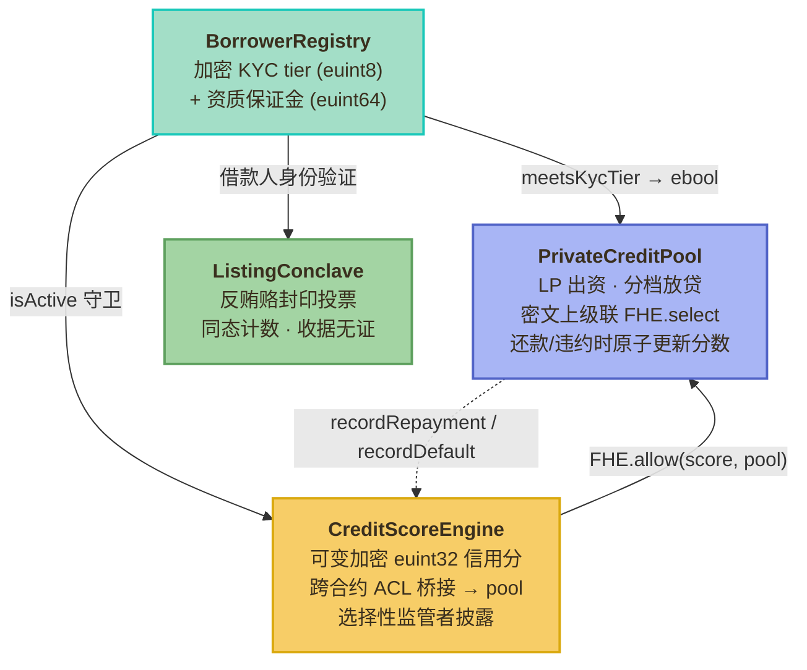

<p align="right"><a href="README.md">English</a> · <strong>简体中文</strong></p>

# Conclave

一个为 tokenized RWA（代币化现实资产）打造的**机密私募信贷池**，基于 [Zama fhEVM](https://docs.zama.ai/protocol)。借款人的 KYC 等级、信用分数、池仓位全部以密文存储在**公链**上；抵押率档位完全在密文域里通过 cascading `FHE.select` 解析；承销决策由同态加密的"conclave 议事会"密封投票。

[](https://conclave-rho.vercel.app)
[](#部署-sepolia)
[](#测试)
[](#anti-pattern-审计)
[](LICENSE)

<p align="center">
  
</p>

<p align="center">
  <em>4 个合约对应 4 个 app；persona 切换器是 fhEVM <code>FHE.allow</code> ACL 的视觉镜像 —— 同一份加密状态，不同 key 看到不同视图。</em>
</p>

## 对比一眼

<p align="center">
  
</p>

<p align="center">
  <em>同一个借款人，同一个区块高度。BlackRock 的 27.5 亿美元 BUIDL 基金把每个持有人、余额、资金流全部暴露给竞争对手；JPMorgan Kinexys 私有 —— 但运行在封闭网络上。Conclave 跑在<strong>公链 L1</strong>，全程加密，给监管者一个 per-borrower 解密 key。</em>
</p>

## 核心特性

- **信用分作为可变密文状态** —— `euint32 score` 存在链上。还款 / 违约事件**原子地**在同一笔交易里更新分数，不需要 off-chain issuer 重新签发凭证。
- **密文域里的级联档位解析** —— `FHE.select` 只暴露最终的抵押档位（50 / 75 / 100 / 150%），分数本身永远不解密。
- **ERC-3643 风格的 KYC 钩子** —— `meetsKycTier(id, minTier)` 返回 `ebool`，下游协议可以同态组合这个门禁，不需要看到原始 tier。
- **反贿选承销 conclave** —— 同态投票计数；投票人之后**也无法**向贿选者证明自己投了什么。比 commit-reveal 更强，无需 trusted coordinator（不像 MACI）。
- **监管者选择性披露** —— `FHE.allow(score, regulator)` 按借款人 opt-in 授权；同一份加密状态既能产出公开的阈值证明，也能被授权审计员选择性解密。

## 架构



| 合约 | 用途 | 行数 |
|---|---|---|
| [`BorrowerRegistry`](contracts/BorrowerRegistry.sol) | 加密 KYC tier + ERC-3643 风格的转账合规钩子 | 100 |
| [`CreditScoreEngine`](contracts/CreditScoreEngine.sol) | 可变加密信用分、监管选择性披露、跨合约 ACL 桥接 | 170 |
| [`PrivateCreditPool`](contracts/PrivateCreditPool.sol) | LP 出资池、级联档位解析、原子 score-as-state | 165 |
| [`ListingConclave`](contracts/ListingConclave.sol) | 反贿选加密承销委员会 | 100 |

## 安装

```bash
git clone https://github.com/0xE1337/conclave.git
cd conclave
npm install
```

## 快速开始

```bash
# 跑测试套件（mock fhEVM，约 1 秒）
npx hardhat test

# 编译 + 生成类型
npx hardhat compile

# 部署到 Sepolia（自动 wire 关键的 ACL 桥接）
npx hardhat vars set MNEMONIC
npx hardhat deploy --network sepolia --tags Conclave

# 前端
cd frontend && npm install && npm run dev
```

## 部署 Sepolia

Sepolia 测试网：

| 合约 | 地址 |
|---|---|
| BorrowerRegistry | [`0x23D2566b41964AD73c649f607d35f745e6EB065A`](https://sepolia.etherscan.io/address/0x23D2566b41964AD73c649f607d35f745e6EB065A) |
| ListingConclave | [`0x555B150429A8C7Ec8C5d19c894d956645C0878e1`](https://sepolia.etherscan.io/address/0x555B150429A8C7Ec8C5d19c894d956645C0878e1) |
| CreditScoreEngine | [`0xd0AAFbd8C223f689E18Fba4F867500cE9A4DE8f1`](https://sepolia.etherscan.io/address/0xd0AAFbd8C223f689E18Fba4F867500cE9A4DE8f1) |
| PrivateCreditPool | [`0xe93C152887Cf45F01655641ff590F6c9CCf7e47C`](https://sepolia.etherscan.io/address/0xe93C152887Cf45F01655641ff590F6c9CCf7e47C) |

ACL 桥接 ([`setPool`](https://sepolia.etherscan.io/tx/0x452a30c8c3ebb287241b12a4730e23ab3216c106daff1228171e10b8bd7df2a1)) 由部署脚本自动 wire。

## 使用示例

### 注册借款人（governor）

```solidity
// 加密输入由客户端 @zama-fhe/relayer-sdk 构造：
//   tier  : euint8  (1=零售, 2=合格投资人, 3=qualified-purchaser, 4=机构)
//   bond  : euint64 (合规保证金, 加密)
registry.register(walletAddr, encTier, tierProof, encBond, bondProof);
```

### Score-as-state 生命周期

```solidity
// 在借贷 tx 内原子更新 —— 无需 off-chain issuer。
function repay(uint256 loanId) external payable {
    // ...
    credit.recordRepayment(borrowerId);   // 同一笔 tx 内 bump euint32 score
    // ...
}
```

### 级联档位解析（只有档位离开密文）

```solidity
ebool isTier1 = FHE.ge(score, FHE.asEuint32(80));
ebool isTier2 = FHE.ge(score, FHE.asEuint32(50));
ebool isTier3 = FHE.ge(score, FHE.asEuint32(20));

euint32 pct = FHE.select(isTier1, FHE.asEuint32(50),
              FHE.select(isTier2, FHE.asEuint32(75),
              FHE.select(isTier3, FHE.asEuint32(100),
                                  FHE.asEuint32(150))));
FHE.makePubliclyDecryptable(pct);
```

### 反贿选投票

```solidity
// 投票被同态加法消化 —— 没有 per-voter 句柄遗留下来。
ebool vote = FHE.fromExternal(encVote, proof);
p.approves = FHE.add(p.approves, FHE.select(vote, ONE, ZERO));
p.rejects  = FHE.add(p.rejects,  FHE.select(vote, ZERO, ONE));
```

### 监管者选择性披露

```solidity
// 借款人主动 opt-in。只有配置的监管者地址能解密分数；
// 协议、LP、其他对手方仍然只看到密文。
function grantRegulatorAccess(uint256 id) external {
    require(msg.sender == registry.walletOf(id));
    FHE.allow(_credits[id].score, regulator);
}
```

## Anti-pattern 审计

4 个合约全部通过 [`fhevm-lint`](https://github.com/0xE1337/fhevm-skill)（针对 fhEVM 隐私 / ACL bug 的 12 条静态检查）：

```
contracts/BorrowerRegistry.sol    ✓ no fhEVM anti-patterns detected
contracts/CreditScoreEngine.sol   ✓ no fhEVM anti-patterns detected
contracts/PrivateCreditPool.sol   ✓ no fhEVM anti-patterns detected
contracts/ListingConclave.sol     ✓ no fhEVM anti-patterns detected
```

`PrivateCreditPool` 在打 tag 前修了两个第 3 层（隐私边界）问题：

- **#15 trivial encryption** —— 移除了一个 `FHE.eq(stored, FHE.asEuint32(claimedPct))`，右操作数本来就是 calldata 里的 plaintext `uint256`。档位完整性改由 off-chain coprocessor 解密 `makePubliclyDecryptable` 存的 handle 来保证，而不是对一个本就公开的值做冗余的链上加密。
- **#16 event leak** —— `Borrowed` 事件改为对 `collateral` 和 `collateralPct` 字段 emit `type(uint256).max` 占位符（ERC-7984 惯例）。明文值仍可从 `loans[loanId]` storage struct 读出，那是 public by design 的（档位策略本来就公开 —— 私密的只有信用分）。

## 测试

```
62 passing
1 pending (Sepolia-only smoke)
```

| 测试套件 | 数量 |
|---|---|
| `BorrowerRegistry` | 10 |
| `CreditScoreEngine` | 18 |
| `PrivateCreditPool` | 19 |
| `ListingConclave` | 13 |
| `FHECounter` (template) | 2 |

跑测试：`npx hardhat test`。

## 选择性披露（视频核心镜头）

<p align="center">
  
</p>

<p align="center">
  <em>级联 <code>FHE.select</code> 只解出档位（50% Elite）；分数永远不解密。<code>FHE.allow(score, regulator)</code> 把选择性解密权授给一个指定地址 —— Public 仍然看到密文，Regulator 看到明文，Borrower 始终掌握所有权。</em>
</p>

## 为什么选 FHE

项目刻意用 FHE 而不是 ZK 选择性披露凭证，原因有 3：

1. **可变状态。** 信用分会随每次还款 / 违约更新。ZK 凭证需要 off-chain issuer 每次重新签发；FHE 状态直接由借贷合约**原子地**和借贷事件一起改写。
2. **可组合句柄。** 拿到 ACL 的下游 fhEVM 合约能针对 live `euint32 score` 做同态组合。借款人档位下降时，访问权自动失效 —— 一次性的 ZK proof 表达不了这个。
3. **选择性解密。** 同一份能产出公开阈值证明（`FHE.ge(score, threshold) → ebool`）的加密状态，也能选择性授权给监管者（`FHE.allow(score, regulator)`）。ZK 披露通常每个披露范围都需要一次单独的 off-chain 重新签发。

## 前端

[Demo dApp](https://conclave-rho.vercel.app) 是一个 Next.js 16 / Tailwind 4 / framer-motion / Turbopack 应用，设计灵感来自 Animal Crossing 的温暖马卡龙调色板，遵循 *"warm in chrome, sharp in data"* 原则 —— 外壳柔软圆润，数据用 monospace 等宽数字。

4 个屏幕 + 1 个 persona 切换器：

| | |
|---|---|
|  |  |
| <strong>Registry</strong> —— 机构借款人名册，KYC tier 加密显示（自己拥有的那行解明文，其他封叶子） | <strong>Score</strong> —— 加密信用分、公式分解、级联 <code>FHE.select</code> 档位解析 |
|  |  |
| <strong>Pool</strong> —— TVL / 活跃贷款 / 还款 / 违约率，档位分布条，活跃贷款表 | <strong>Conclave</strong> —— 封闭的 RWA 上架提案；underwriter 角色用同态投票表决 |

源码：[`frontend/`](frontend/)。截图自动化脚本：[`scripts/capture-screenshots.mjs`](scripts/capture-screenshots.mjs)。

## 致谢

基于 [`@fhevm/solidity@0.11.1`](https://github.com/zama-ai/fhevm-solidity) 构建，参考了 [OpenZeppelin Confidential Contracts](https://github.com/OpenZeppelin/openzeppelin-confidential-contracts)（ERC-7984）模式、[Zama fhEVM Hardhat template](https://github.com/zama-ai/fhevm-hardhat-template)，以及 [T-REX Network](https://www.erc3643.org/) 的 ERC-3643 转账合规钩子思路。

## 许可证

MIT —— 见 [LICENSE](LICENSE)。
